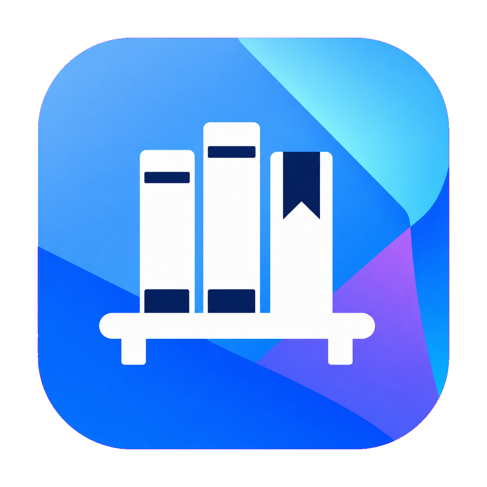
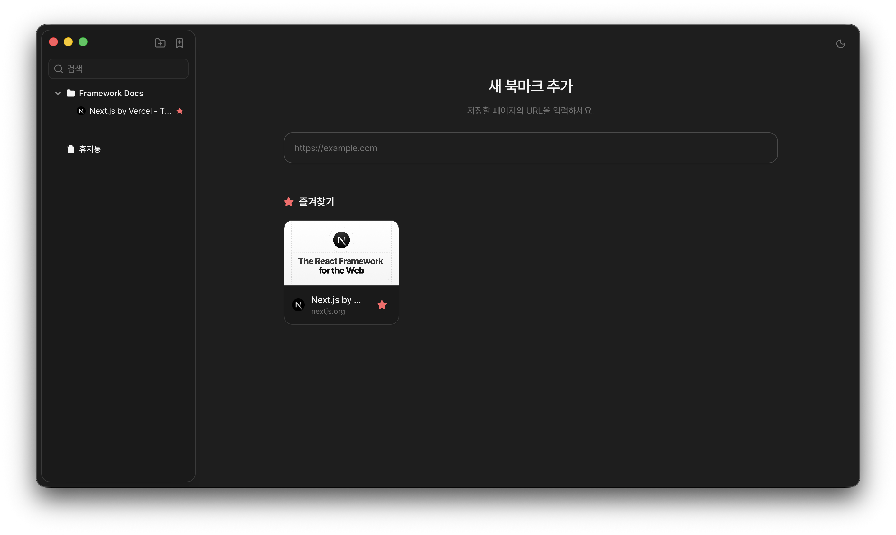
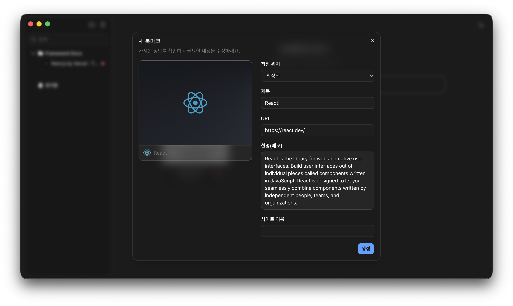

<p align="center">
  
</p>

<h1 align="center">Shelf</h1>

<p align="center">
  A local-first desktop bookmark manager for collecting, organizing, searching, and restoring personal bookmarks.
</p>

<p align="center">
  
</p>

Shelf consists of an Electron desktop client and a lightweight Hono API backed by SQLite.

> [!IMPORTANT]
> Shelf is currently released and tested for macOS only. Windows and Linux builds are not officially supported yet.

## Screenshots

### Bookmark Library



### Bookmark Preview and Creation



## Features

- Create bookmarks from a URL with automatic title, description, site image, and favicon previews
- Normalize URLs without a protocol, such as `example.com`, before validation and preview
- Paste a copied URL anywhere in the application to open the bookmark creation flow
- Choose a destination folder while creating a bookmark
- Create nested folders and organize folders and bookmarks with drag and drop
- Search folders and bookmarks locally with highlighted matches
- Navigate search results with the arrow keys and open the first result with Enter
- Mark bookmarks as favorites and display up to 12 on the main screen
- Reorder favorite cards with drag and drop and persist their positions
- Edit bookmark metadata, including image and favicon URLs
- Soft-delete folders and bookmarks to a trash area
- Inspect deleted folder trees, restore items, permanently delete individual items, or empty the trash
- Confirm destructive actions before permanent deletion
- Light and dark themes

## Architecture

```text
Electron + React desktop application
                 |
                 | HTTP
                 v
           Hono API (:3070)
                 |
                 v
        Drizzle ORM + SQLite
                 |
                 v
       Persistent Docker volume
```

The Electron application is built and run natively. Docker is used for the API and its SQLite database only.

## Tech Stack

### Desktop

- Electron
- React 19
- TypeScript
- Vite and electron-vite
- Tailwind CSS
- shadcn/ui
- TanStack Query and TanStack Router
- React Hook Form and Zod

### API and Database

- Hono
- OpenAPI
- SQLite
- Drizzle ORM and Drizzle Kit
- Zod

### Tooling and Infrastructure

- pnpm workspaces
- Turborepo
- Docker and Docker Compose
- Biome

## Repository Structure

```text
shelf/
├── apps/
│   ├── api/                  # Hono API
│   └── desktop/              # Electron and React application
├── packages/
│   ├── db/                   # Drizzle schema, migrations, and SQLite client
│   └── shared/               # Shared Zod schemas and API types
├── compose.yaml
├── Dockerfile
├── package.json
└── pnpm-workspace.yaml
```

## Prerequisites

- Node.js 18 or later
- pnpm 9
- Docker Desktop or Docker Engine for containerized API usage

## Run the API with Docker Compose

Docker Compose builds the API image, starts the container, creates the persistent SQLite volume, and applies database migrations automatically.

From the repository root, run:

```bash
docker compose up -d --build
```

The API is available at `http://localhost:3070`.

To use a different host port:

```bash
API_PORT=4070 docker compose up -d --build
```

Useful Compose commands:

```bash
# View API logs
docker compose logs -f api

# Stop and remove the container while preserving the database
docker compose down

# Stop the stack and permanently remove the SQLite volume
docker compose down -v
```

> `docker compose down -v` permanently deletes all stored Shelf data.

## Build and Run with Docker

Use this method when you want to manage the image, container, and volume directly without Docker Compose.

### 1. Build the image

```bash
docker build -t shelf-api:latest .
```

### 2. Run the container

```bash
docker run -d \
  --name shelf-api \
  --restart unless-stopped \
  -p 3070:3070 \
  -v shelf-data:/data \
  shelf-api:latest
```

The named `shelf-data` volume preserves the SQLite database when the container is replaced. Database migrations run automatically whenever the container starts.

Container management commands:

```bash
# View logs
docker logs -f shelf-api

# Stop the container
docker stop shelf-api

# Start it again
docker start shelf-api

# Remove the container while preserving its database volume
docker rm -f shelf-api

# Permanently remove the stored database
docker volume rm shelf-data
```

## API Documentation

After starting the API, the generated documentation is available at:

- Swagger UI: [http://localhost:3070/swagger](http://localhost:3070/swagger)
- OpenAPI JSON: [http://localhost:3070/doc](http://localhost:3070/doc)

## Run the Desktop Application on macOS

The desktop application connects to the API at `http://localhost:3070` by default. Start the API first using either Docker method above.

Install dependencies:

```bash
pnpm install
```

Create the desktop environment file:

```bash
cp apps/desktop/.env.example apps/desktop/.env
```

Run the Electron application in development mode:

```bash
pnpm --filter desktop dev
```

## Local Development without Docker

Install dependencies and create the required environment files:

```bash
pnpm install
cp apps/desktop/.env.example apps/desktop/.env
```

Create `apps/api/.env` with the following values:

```dotenv
PORT=3070
DATABASE_URL=../../packages/db/data/shelf.db
```

Apply the database migrations:

```bash
pnpm --filter @shelf/db db:migrate
```

Run the API and desktop application in separate terminals:

```bash
pnpm --filter api dev
```

```bash
pnpm --filter desktop dev
```

## Build for macOS

Build every workspace package:

```bash
pnpm build
```

Build the official macOS desktop package:

```bash
pnpm --filter desktop build:mac
```

Windows and Linux build configurations are retained for future support, but they are currently untested and are not part of the official Shelf release.

## Database Persistence and Reset

The Docker setup stores SQLite data in the `shelf-data` volume. Removing or rebuilding the API container does not remove the database.

To reset a Compose-managed database:

```bash
docker compose down -v
docker compose up -d --build
```

To reset a manually managed Docker database:

```bash
docker rm -f shelf-api
docker volume rm shelf-data
docker run -d \
  --name shelf-api \
  --restart unless-stopped \
  -p 3070:3070 \
  -v shelf-data:/data \
  shelf-api:latest
```

Both reset operations permanently remove existing bookmarks and folders.
